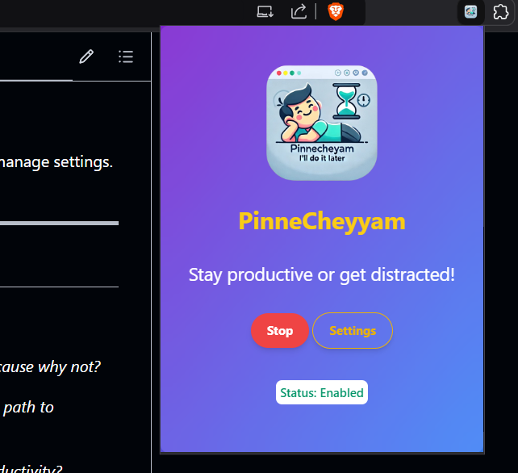
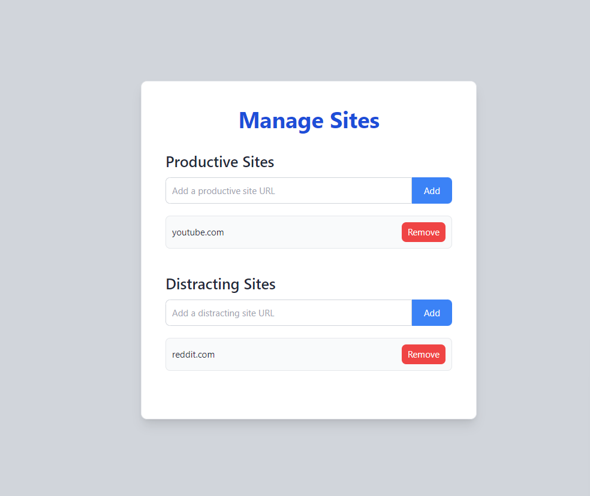
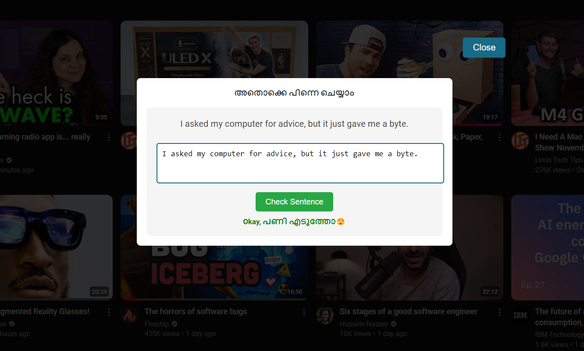
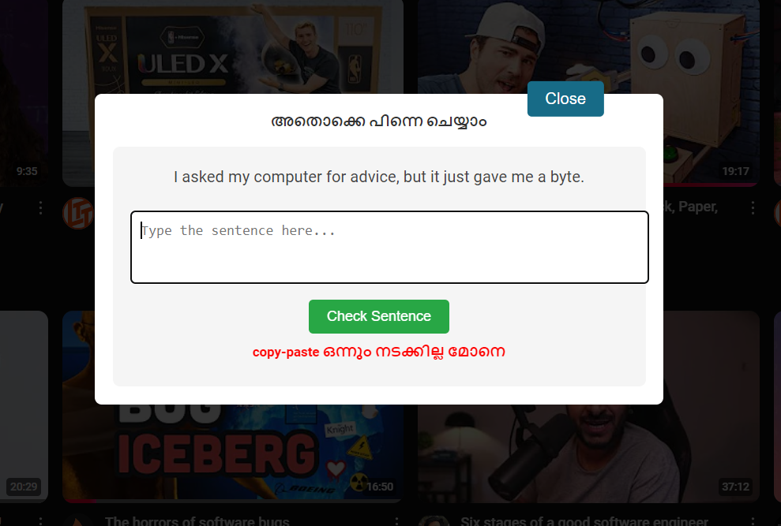
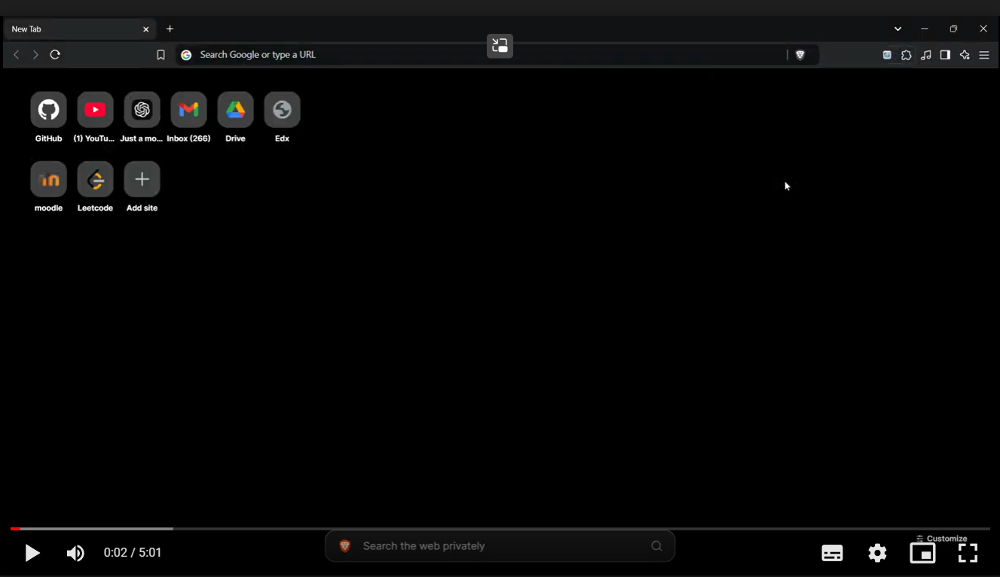

# **PinneCheyyam** 🎯

> ## 🎥 [Click here for demo video](https://drive.google.com/file/d/1gxnh9sCdTn9uknkolp03Cj14UZo5vlDp/view?usp=sharing "🔼 Google Drive - PinneCheyyam Demo 🎥") 🎥


**PinneCheyyam** is a Chrome extension crafted to help you procrastinate like a pro! Distract yourself from productive websites with random quizzes, puzzles, mini-games, and the occasional noise to ensure you stay… delightfully unproductive. 😜


---

## 📝 Basic Details

### 🏆 Team Name: Haskell

### 👥 Team Members

- **Team Lead:** [Nandhu Krishnan A](https://github.com/nandhu-44 "⚡Nandhu ⚡") - Department of Computer Science, Cusat
- **Member 2:** [Nazal Nihad TT](https://github.com/nazalnihad) - Department of Computer Science, Cusat
- **Member 3:** [Jeslin P James](https://github.com/jeslinpjames) - Department of Computer Science, Cusat

### 📚 Project Description

**“PinneCheyyam”** is a productivity killer disguised as a Chrome extension. Every time you try to do something meaningful, this extension will ensure you have to complete random, pointless tasks to proceed. Perfect for those who are tired of productivity and crave more distractions in life! 🎉

### 🤔 The Problem (that doesn't exist)

People are too focused on productive websites, making their lives boring. Why spend your time getting things done when you could be solving puzzles and taking quizzes instead? 🥱

### 💡 The Solution (that nobody asked for)

**PinneCheyyam** forces users to complete random tasks to "unlock" the productive website they’re trying to use. By spending time solving distractions, users can avoid real work and enjoy the joy of random interruptions. 🛑🔓

---

## 🔧 Technical Details

### 🛠️ Technologies/Components Used

**For Software:**

- **Languages:** JavaScript, HTML, CSS
- **Frameworks/Libraries:** Tailwind CSS, Chrome Extensions API
- **Tools:** VSCode, Git, GitHub, Chrome Developer Tools

---

## 🚀 Implementation

### 🛠️ Installation

1. **Clone the repository:**

    ```bash
    git clone https://github.com/nandhu-44/Useless-Project-TinkerHub.git
    ```

2. **Load the extension in Chrome:**

    - Go to [chrome://extensions/](chrome://extensions/) (or the extensions page of your **Chromium** based browser).
    - Enable "Developer mode."
    - Click "Load unpacked" and select the `pinne-cheyyam` directory.

### ▶️ Run

After installing, click on the extension icon in the Chrome toolbar to enable/disable distractions and manage settings. Head to your favorite productive sites to experience a variety of pointless interruptions! 🕹️🎲

### 📂 Project Structure

```js
├── .gitignore                    // Specifies files and folders to ignore in version control
├── pinne-cheyyam                 // Main folder containing all extension code
│   ├── background.js             // Background script for handling persistent extension tasks
│   ├── content.js                // Content script injected into web pages
│   ├── icons                     // Folder containing extension icons
│   │   └── icon.png              // Primary icon for the extension
│   ├── manifest.json             // Manifest file defining extension metadata and permissions
│   ├── options                   // Folder for options/settings page of the extension
│   │   ├── options.html          // HTML for the options/settings page UI
│   │   └── options.js            // JavaScript for handling options page interactions
│   ├── popup                     // Folder for popup UI displayed when the extension icon is clicked
│   │   ├── popup.html            // HTML for the extension's popup UI
│   │   └── popup.js              // JavaScript for handling popup interactions
│   └── tailwind.js               // Tailwind CSS configuration or script file
└── README.md                     // Main documentation file describing the project
```

### 📁 Folder and File Descriptions

- **.gitignore**: Lists files and directories to be ignored by Git.
- **pinne-cheyyam**: Contains the core codebase for the PinneCheyyam extension.
  - **background.js**: Runs in the background, handling tasks that need to persist even when the popup is closed.
  - **content.js**: Script injected into web pages, allowing interaction with the page's content.
  - **icons**: Stores icons used by the extension.
    - **icon.png**: The main icon displayed in the Chrome toolbar.
  - **manifest.json**: Defines extension metadata, permissions, and settings.
  - **options**: Manages the settings page where users can configure extension options.
    - **options.html**: HTML layout for the options/settings page.
    - **options.js**: Script handling functionality on the options page.
  - **popup**: Files related to the popup displayed when the extension icon is clicked.
    - **popup.html**: HTML layout for the popup interface.
    - **popup.js**: Script managing interactions within the popup.
  - **tailwind.js**: Tailwind CSS configuration or custom styling for the extension.
- **README.md**: Provides an overview of the project, installation instructions, and usage guidelines.

---

## 📄 Project Documentation

### 📸 Screenshots (A Glimpse into the Uselessness)


*Our sleek popup interface with 'Start Annoying' button – because why not?* 🎉


*Manage your productive and distracting sites. Personalize your path to procrastination!* 🛠️



*Type the random sentence letter by letter without any cheap tricks to "unlock" ?* 📝

---

## 🎥 Project Demo

### 📹 Video

[](https://drive.google.com/file/d/1gxnh9sCdTn9uknkolp03Cj14UZo5vlDp/view?usp=sharing)

[👉 Click here to watch the demo](https://drive.google.com/file/d/1gxnh9sCdTn9uknkolp03Cj14UZo5vlDp/view?usp=sharing)

---

## 🤝 Team Contributions

- **Nandhu Krishnan A:**
  - Set up the project, created the README, and handled documentation.
  - Designed the UI/UX of the extension.
  - Refined the logic flow to improve extension performance.

- **Nazal Nihad TT:**
  - Developed the core functionality and logic for the quotes game.
  - Implemented data saving and retrieval for the extension.
  - Added timed pop-ups for distractions.

- **Jeslin P James:**
  - Curated the quotes for the game.
  - Enhanced text content for alerts and error messages.

---

## 🔮 Future Plans

- 🕹️ **Mini-games and puzzles** with increasing difficulty levels.
- 🎵 **More distractions** like sound effects, animations, and interactive elements.
- 🎨 **Customizable themes and settings** for users to personalize their experience.
- 🖥️ **Modifying the UI** of productive websites to make them more distracting/hard to focus on.

---

Made with ❤️ and a sense of humor at **TinkerHub Useless Projects**


---

**Enjoy the journey to decreased productivity, one distraction at a time!** 🚀😆
